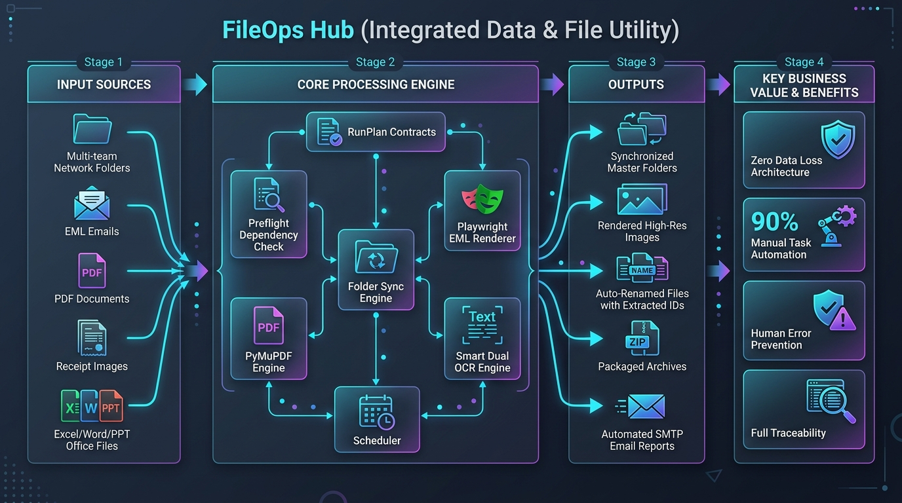
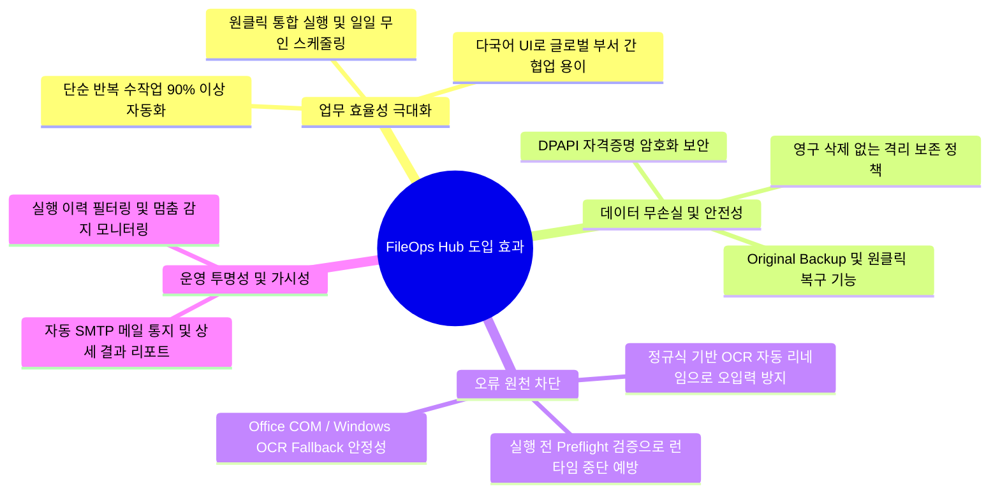
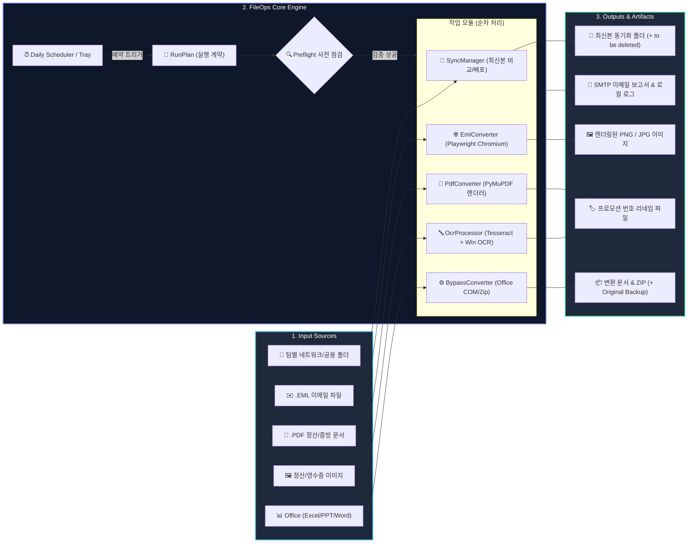

# FileOps Hub (Integrated Data & File Utility) 프로젝트 요약 보고서



---

## 📌 1. 프로젝트 개요 (Overview)

**FileOps Hub(Integrated Data & File Utility)** 는 사내 여러 팀이 개별적으로 관리하는 최신 매뉴얼 및 업무 자료를 공용 배포 폴더로 안전하게 동기화하고, 정산·검수·보관에 필요한 다양한 문서/이메일 변환 및 OCR 추출 작업을 단일 데스크톱 환경에서 자동화하는 **Windows 전용 엔터프라이즈 파일 운영 자동화 솔루션**입니다.

- **플랫폼 & UI**: Windows 10/11, Python 3.13+, PyQt6 GUI (시스템 트레이 무인 실행 지원)
- **아키텍처**: UI 계층과 Core 비즈니스 로직의 완전한 분리 (명시적 `RunPlan` 실행 계약 기반)
- **다국어 지원 (i18n)**: 한국어, English, Polski (Windows 언어 자동 감지 및 런타임 전환)
- **보안 & 권한**: 사용자 권한 임의 우회 없음 (OS/네트워크 드라이브 기존 ACL 준수), DPAPI 자격증명 암호화

---

## 📥 2. Input 데이터 (입력 소스)

시스템은 업무 프로세스별로 다음과 같은 다양한 형태의 원본 데이터를 입력으로 처리합니다:

| 구분 | 대상 데이터 형식 | 입력 경로 / 소스 | 주요 내용 및 특징 |
| :--- | :--- | :--- | :--- |
| **Sync (폴더 동기화)** | 문서 및 업무 파일 전반 (xlsx, docx, pdf 등) | 다중 부서 로컬/네트워크 드라이브, OneDrive, SharePoint 마운트 경로 | 각 부서별 최상위 파일 목록 및 수정 시간(mtime), 파일 해시 |
| **EML (메일 이미지화)** | `.eml` (RFC 822 표준 이메일 메시지) | 소스 폴더 내 이메일 아카이브 파일 | HTML/텍스트 본문, 인라인 이미지, 발신/수신 메타데이터 |
| **PDF (PDF 이미지 변환)** | `.pdf` (전자 문서, 인보이스, 계약서) | 단일/복수 선택 PDF 파일 | 다중 페이지로 구성된 정산 전표 및 증빙 문서 |
| **OCR (텍스트 추출)** | `.jpg`, `.jpeg`, `.png`, `.bmp` | 이미지 폴더 또는 변환된 페이지 이미지 | 프로모션 번호, 바코드/영수증 번호 등이 포함된 문서 이미지 |
| **Convert Files (파일 변환)**| `.xlsx`, `.xls`, `.pptx`, `.ppt`, `.docx`, `.doc`, `.pdf` | 원본 문서 디렉토리 | 사내 시스템 업로드용 Office 문서 및 대용량 PDF |
| **시스템 설정 / 스케줄** | JSON 설정 (`setting_integrated.json`) | `%LOCALAPPDATA%\IntegratedDataTool\` | 실행 주기, 활성화 태스크, SMTP 서버/계정, Tesseract 경로 등 |

---

## ⚙️ 3. 기능 및 핵심 로직 (Features & Core Logic)

FileOps Hub는 **UI에 종속되지 않는 순수 Core 엔진**과 **엄격한 사전 검증(Preflight)** 기반의 파이프라인으로 설계되었습니다.

```text
[UI 탭 설정] ──(build_run_config)──▶ [RunPlan 계약 생성] ──▶ [Preflight 사전 점검]
                                                                     │
[SMTP 알림 / 리포트] ◀── [결과 보고서 (RunReport)] ◀── [TaskRunner 순차 실행]
```

### 핵심 처리 모듈별 로직

1. **Tasks (통합 파이프라인 및 스케줄러)**
   - 활성화된 각 탭의 설정을 `RunPlan`으로 통합 패키징.
   - 실행 전 Tesseract OCR, Playwright Chromium, Office COM, SMTP 연결성을 사전에 자동 점검(`Preflight`).
   - 매일 지정 시각에 백그라운드 순차 자동 실행 및 완료 시 담당자 SMTP 이메일 통지 (실패 시 로컬 리포트 저장).

2. **Sync (지능형 폴더 양방향 동기화)**
   - 여러 부서 폴더 간 최상위 파일의 수정 일시(mtime)와 해시를 비교하여 최신본 배포.
   - **무손실 안전 정책**: 구버전 또는 충돌 파일은 영구 삭제하지 않고 `to be deleted` 보존 폴더로 안전 격리.

3. **EML (Playwright 기반 고품질 메일 렌더링)**
   - `.eml` 원본을 파싱하여 본문 HTML/CSS를 추출.
   - Headless Chromium 브라우저를 구동하여 실제 메일 클라이언트와 동일한 고해상도 `.png` 이미지로 렌더링 (내용 불변 시 자동 Skip).

4. **PDF (PyMuPDF 초고속 벡터/이미지 변환)**
   - PyMuPDF(`fitz`) 렌더링 엔진을 통해 PDF 문서의 각 페이지를 고화질 `.jpg` 이미지로 일괄 추출.
   - 정산 시스템 업로드 및 OCR 파이프라인 전처리 데이터로 공급.

5. **OCR (듀얼 엔진 텍스트 추출 & 스마트 리네임)**
   - **Tesseract 우선 + Windows 내장 WinRT OCR 자동 Fallback** 구조 적용 (환경 의존성 제로화).
   - 정규식 기반으로 이미지 내 프로모션/정산 번호 자동 인식.
   - 중복 방지 인덱싱(`_1`, `_2`)을 적용하여 표준화된 파일명으로 자동 리네임.

6. **Convert Files (Office COM 변환 & 원본 보호 백업)**
   - `pywin32` Office COM 인터페이스를 통한 Excel/PPT/Word 무손실 포맷 변환 및 PDF ZIP 압축 패키징.
   - **Original Backup 보호 시스템**: 사용자 선택 시 출력 파일 생성 검증 후 원본을 `Original Backup`으로 이동(Manifest 기록), 언제든 GUI에서 1-클릭 안전 복구(Restore) 지원.

---

## 📤 4. 출력 내용 (Outputs)

| 구분 | 출력 형태 / 결과물 | 저장 위치 및 형식 |
| :--- | :--- | :--- |
| **동기화 결과** | 최신본 배포 파일 & 격리 파일 | 대상 공용 배포 폴더, 구버전 보존 폴더 (`to be deleted/`) |
| **EML 렌더링** | 고해상도 이메일 본문 이미지 | 지정 출력 폴더 내 `[메일명].png` |
| **PDF 이미지** | 페이지별 고화질 렌더링 이미지 | 지정 출력 폴더 내 `[문서명]_page_001.jpg` 등 |
| **OCR 리네임 파일** | 정규화된 이름의 이미지 파일 | `[추출된프로모션번호]_[기존명].jpg` 등 |
| **변환/패키징 문서**| 호환 포맷 문서 및 압축본 | 대상 폴더 내 변환 파일, `.zip` 패키지, `Original Backup/` |
| **실행 리포트 & 로그**| 이메일 알림 및 HTML/JSON 보고서 | 담당자 수신함 (SMTP 메일), `%LOCALAPPDATA%\IntegratedDataTool\reports\` |

---

## 💡 5. 기대 효과 (Business Impact & Value)



1. **업무 생산성 혁신 (수작업 공수 90% 감축)**:
   - 팀별 폴더 수동 복사, 메일 캡처, 전표 번호 타이핑, 오피스 파일 개별 변환 작업을 원클릭 또는 일일 자동 예약 실행으로 완전 자동화.
2. **데이터 유실 및 인적 실수 제로화 (Zero Data Loss)**:
   - 모든 변환/동기화에서 원본 영구 삭제를 금지하고 `Original Backup` 및 `to be deleted` 폴더 격리 보존.
   - 복구 매니페스트 기반의 충돌 없는 원클릭 복원 지원.
3. **높은 시스템 안정성 및 유연성**:
   - Tesseract 미설치 PC에서도 Windows 내장 OCR로 자동 전환되어 중단 없는 업무 수행.
   - Chromium 미설치 시 자동 설치 시도 및 Office COM 실행 전 상태 검증.
4. **운영 투명성 및 이력 관리**:
   - 매일 수행된 작업 통계(성공/실패/건수)가 담당자 메일로 즉시 보고되고, 로컬에 영구 리포트가 누적되어 감사 및 이력 추적 용이.

---

## 📊 6. 시스템 아키텍처 및 데이터 흐름도



---

## ⚡ 7. 핵심 요약 (4대 항목 1~2줄 포인트)

1. **Input 데이터**: 부서별 공유 폴더 문서, `.eml` 이메일, 다중 페이지 `.pdf`, 정산/영수증 이미지, Office 문서 및 실행 주기/SMTP 계정 설정값.
2. **기능 / 로직**: UI-코어 분리 기반의 `RunPlan` 사전 점검(`Preflight`) 후 폴더 양방향 동기화, Playwright EML 렌더링, PyMuPDF 이미지 변환, Dual OCR(Tesseract+WinRT) 리네임, Office COM 변환/원본 백업 및 무인 일일 스케줄러를 순차 실행.
3. **출력 내용**: 최신본 동기화 폴더(구버전은 `to be deleted` 격리), 고해상도 `.png`/`.jpg` 이미지, 프로모션 번호 리네임 파일, 호환 변환/ZIP 문서(`Original Backup` 보존), SMTP 완료 알림 메일 및 로컬 보고서.
4. **기대 효과**: 단순 반복 수작업 90% 이상 감축, 원본 영구 삭제 없는 무손실 격리 보존(Zero Data Loss), OCR 자동화 및 사전 점검을 통한 휴먼 에러 원천 차단.

